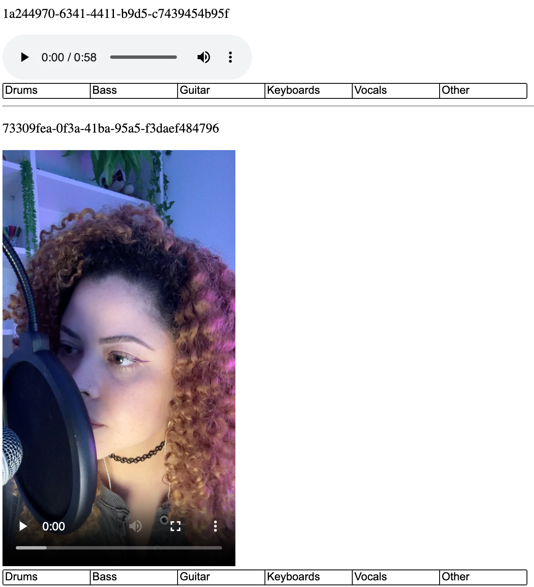

# track_classifier

web app to help in the manual track classification

## Table of Contents

- [track\_classifier](#track_classifier)
  - [Table of Contents](#table-of-contents)
  - [Installation](#installation)
  - [Usage](#usage)
    - [Labeling](#labeling)
    - [Testing](#testing)
    - [Preprocess, feature extraction and model training](#preprocess-feature-extraction-and-model-training)

## Installation

1. After cloning this project, create a `virtualenv` with `python3`

```shell
python3 -m venv .venv
```

2. Activate your `virtualenv`

```shell
source .venv/bin/activate
```

3. Install the dependencies

```shell
make install
```

4. Setup [Google Application Default Credentials](https://cloud.google.com/docs/authentication/application-default-credentials?hl=pt-br)

```shell
gcloud auth application-default login
```

5. For model training and evaluation usage on MacOS:
````shell

````

## Usage

### Labeling

1. Run the application

```shell
make run
```

2. Go to 'http://127.0.0.1:5000' in your browser.

3. There you should see the tracks and buttons with the name of the instruments (see image below).



4. Select the instruments that are present in the track (you can select multiple instruments).

5. Scroll down the page and click the 'Submit!' button. 

6. Wait for the alert indicanting the submission is done.

7. Alternatively you can go to:
 - 'http://127.0.0.1:5000/user/[username]' to see tracks of a single user.
 - 'http://127.0.0.1:5000/instrument/[instrument]' to see tracks originated by the track separation feature for a single instrument.

### Testing

1. Run the tests

```shell
pytest
```

### Preprocess, feature extraction and model training

1. Remove silence from tracks and make samples of 10 seconds

```shell
make process
```

2. Feature extraction using [Essentia](https://essentia.upf.edu/installing.html#compiling-essentia)

```shell
make extract
```

3. For model training and evaluation, use notebooks/training_testing_models.ipynb

4. If you plan on using LightGBM Classifier on macOS:

```shell
make lightgbm.mac
```

5. LightGBM on Linux
```shell
make lightgbm.linux
```
